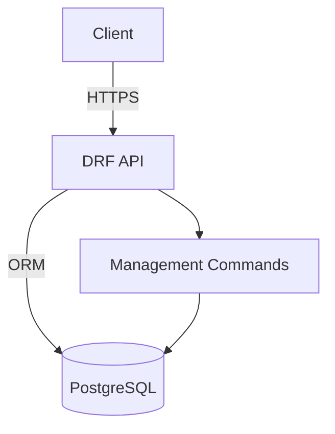

# Architecture

## Modules
- **accounts** – custom user model and JWT auth
- **store** – store catalog and branch head assignment
- **attendance** – check‑in/out, approvals and reports

## Request lifecycle
1. Client authenticates with JWT (`Authorization: Bearer`).
2. DRF views/routers dispatch to app logic.
3. Serializers validate and interact with models.
4. Responses use Spring-style pagination when listing.

## Signals & middleware
- `accounts.signals.auto_unassign_branch_head_on_user_change` removes inactive branch heads and clears their store.
- Middleware stack includes CORS, session and WhiteNoise for static files.
