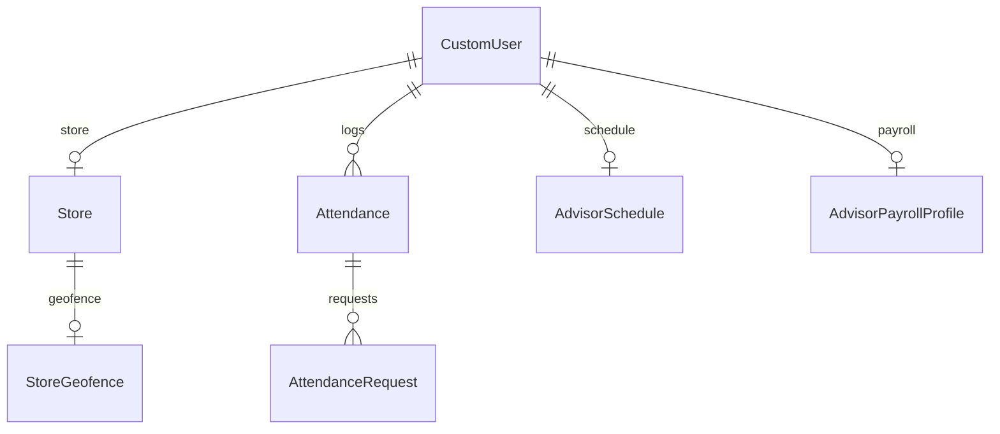

# Database



## Entities
- **CustomUser** – roles (`system_admin`, `branch_head`, `advisor`) and optional `store`.
- **Store** – basic store info and one-to-one `branch_head` & `geofence`.
- **Attendance** – daily punches with status and worked minutes.
- **AttendanceRequest** – late/OT/geofence approvals linked to an attendance.
- **Shift**, **AdvisorSchedule**, **WeekOff**, **ScheduleException** – scheduling rules.
- **GenericIdempotency** – stores processed `Idempotency-Key` values.

## Migrations
Use Django migrations:
```bash
python manage.py makemigrations
python manage.py migrate
```

Seed basics for development:
```bash
python manage.py seed_attendance_basics
```
