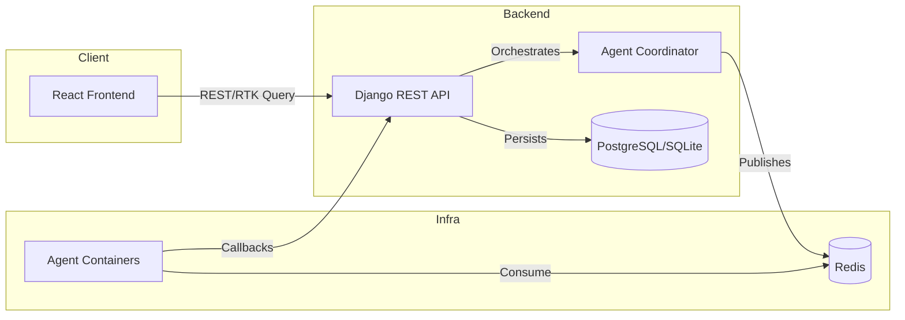

# System Architecture Explanation

This explanation summarizes how the Finetune ERP platform is composed and how data flows between the backend, frontend, and worker agents.

## Backend layers

- **Coordinator** – Lives in `finetune-ERP-backend-New/agents/` and exposes the `AgentProtocol`. It accepts jobs from the API, pushes payloads to Redis, and ingests worker callbacks.
- **Domain apps** – Django apps under `accounts`, `bookings`, `inventory`, `marketing`, and `attendance` expose REST endpoints through DRF routers. The URLs listed in [API_ROUTES.md](reference/API_ROUTES.md) reflect each registered router or path.
- **Settings & configuration** – Environment variables outlined in [ENVIRONMENT_KEYS.md](reference/ENVIRONMENT_KEYS.md) control secrets, notification channels, and feature toggles. The project defaults to SQLite for local development and switches to PostgreSQL when `DATABASE_URL` points at a managed database.

> [!NOTE]
> Keep router registrations centralized—`scripts/generate_references.py` depends on DRF conventions to keep the reference file accurate.

## Frontend structure

- **Routing** – `src/App.jsx` wires marketing pages, customer-authenticated flows, and admin dashboards with React Router 7. Layout components (`PublicLayout`, `FocusLayout`, `DashboardLayout`) manage responsive breakpoints and share theming.
- **State management** – Redux Toolkit Query (`src/api/erpApi.js`) handles API requests, automatic token refresh, and cache invalidation. Hooks generated by the slice power dashboards, booking forms, and inventory tools.
- **Design system** – Tailwind utility classes and CSS variables in `src/index.css` define colors and spacing. Components must rely on the layout shells to avoid competing layout authorities.

## Agent ecosystem

- **Registry** – YAML descriptors list available agent containers, their capabilities, and the Docker images to pull.
- **Worker lifecycle** – Agents listen for jobs on Redis, execute domain-specific logic (e.g., invoicing, marketing exports), and report back via REST hooks under `/agents/<name>/hooks`.
- **Failure handling** – The coordinator retries transient errors and records audit trails under `/api/logs/`.

## Data flow & integration points

1. A customer or internal user triggers an action in the frontend.
2. The frontend sends an authenticated request to the Django API using the RTK Query client.
3. The API validates the request, persists state changes, and optionally enqueues asynchronous work via the coordinator.
4. Worker agents process queued tasks and call back into the API when complete.
5. The frontend polls or subscribes to updated state, rendering the latest results.

## Security and observability

- JSON Web Tokens secure dashboard APIs. Refresh/verify routes are published via [API_ROUTES.md](reference/API_ROUTES.md).
- CSP, CORS, and HTTPS settings derive from environment keys to keep deployment-specific overrides in configuration rather than code.
- Audit trails are stored through the `activity` app and exposed under `/api/logs/` for compliance.
