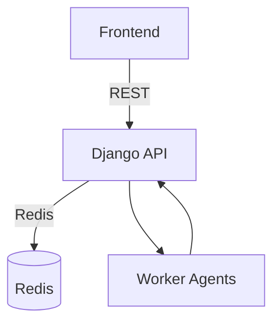

# Architecture

- `finetune-ERP-backend-New`: Django REST backend providing coordinator and agent hooks.
- `finetune-ERP-frontend-New`: React + Vite frontend consuming the API.
- Redis queue connects the coordinator with worker agents.
