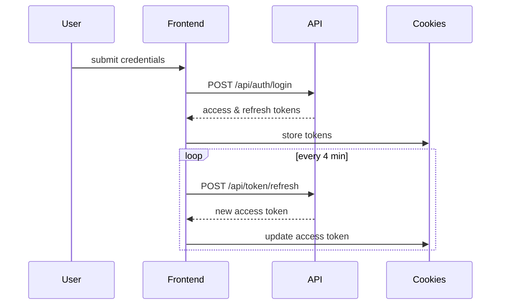

# Authentication & Authorization

This guide explains how authentication and authorization work across the Finetune ERP platform, covering both backend JWT implementation and frontend token management.

## Backend Authentication

The API uses JSON Web Tokens via `rest_framework_simplejwt` for secure authentication.

### JWT Flow

1. **Login** – `POST /api/auth/login` with `username` and `password` returns `access` (60 min), `refresh` (7 days), and echoes back `username`, `role`, and `store` (which may be `null`).
2. **Refresh** – `POST /api/token/refresh` with a refresh token rotates it and issues a new pair.
3. **Verify** – `POST /api/token/verify` checks if a token is valid.
4. **Logout** – `POST /api/auth/logout` blacklists a refresh token.

Tokens are sent in the `Authorization: Bearer <access>` header.

`store` is `null` when the user is not associated with any store or the related store has been deleted.

### Roles

`CustomUser.role` defines project roles:
- **system_admin** – full control.
- **branch_head** – manage advisors within their store.
- **advisor** – self-service attendance.

### API Examples

```bash
# Login
curl -X POST http://localhost:8000/api/auth/login \
  -H 'Content-Type: application/json' \
  -d '{"username":"admin","password":"pw"}'

# Refresh
curl -X POST http://localhost:8000/api/token/refresh \
  -H 'Content-Type: application/json' \
  -d '{"refresh":"<refresh>"}'

# Authenticated request
curl http://localhost:8000/api/attendance/me/today \
  -H 'Authorization: Bearer <access>'

# Current user profile
curl http://localhost:8000/api/auth/me \
  -H 'Authorization: Bearer <access>'
```

## Frontend Authentication

The frontend manages authentication tokens and implements automatic token refresh for seamless user experience.

### Token Flow



### Token Storage

Tokens (`access_token` & `refresh_token`) and user details are returned on login. Tokens are stored in `cookies` and attached to API calls via a Redux Toolkit Query base query with automatic re-authentication.

Example login response:

```json
{
  "access": "<jwt>",
  "refresh": "<jwt>",
  "username": "AdminPT",
  "role": "system_admin",
  "store": 9
}
```

### Route Protection

| Route                  | Requirement                                    |
| ---------------------- | ---------------------------------------------- |
| `/dashboard`           | authenticated user                             |
| `/dashboard/users`     | role `system_admin`                            |
| `/dashboard/stores`    | role `system_admin`                            |
| `/dashboard/settings`  | role `system_admin`                            |
| `/giveaway-redemption` | roles `system_admin`, `branch_head`, `advisor` |
| `/workledger/*`        | roles `system_admin`, `branch_head`, `advisor` |

### State Management

Authentication is managed by `src/redux/slice/authSlice.js`; consumers dispatch `loginUser` and `logoutUser` and read state via selectors. The `logoutUser` thunk posts to `/api/auth/logout` before clearing authentication cookies.

## Related Documentation

- [API Routes Reference](reference/API_ROUTES.md) – Authentication endpoint details
- [Security Guide](SECURITY.md) – Security best practices
- [Developer Guide](DEVELOPER_GUIDE.md) – Development workflows

