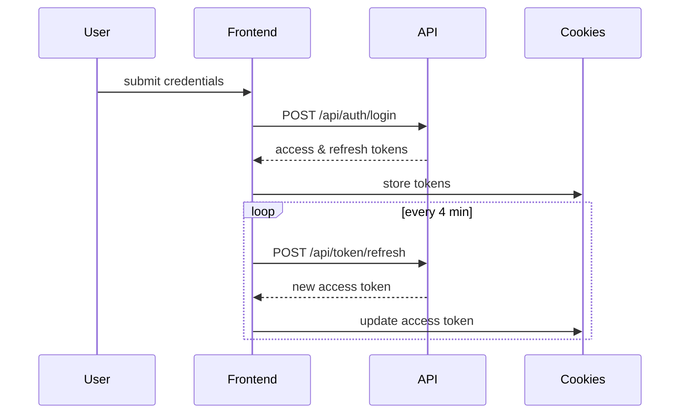

# Authentication



Tokens (`access_token` & `refresh_token`) and user details are returned on login. Tokens are stored in `cookies` and attached to API calls via a Redux Toolkit Query base query with automatic re-authentication.

Example login response:

```json
{
  "access": "<jwt>",
  "refresh": "<jwt>",
  "username": "AdminPT",
  "role": "system_admin",
  "store": 9
}
```

## Route protection

| Route                  | Requirement                                    |
| ---------------------- | ---------------------------------------------- |
| `/dashboard`           | authenticated user                             |
| `/dashboard/users`     | role `system_admin`                            |
| `/dashboard/stores`    | role `system_admin`                            |
| `/dashboard/settings`  | role `system_admin`                            |
| `/giveaway-redemption` | roles `system_admin`, `branch_head`, `advisor` |
| `/workledger/*`        | roles `system_admin`, `branch_head`, `advisor` |

Authentication is managed by `src/redux/slice/authSlice.js`; consumers dispatch `loginUser` and `logoutUser` and read state via selectors. The `logoutUser` thunk posts to `/api/auth/logout` before clearing authentication cookies.
