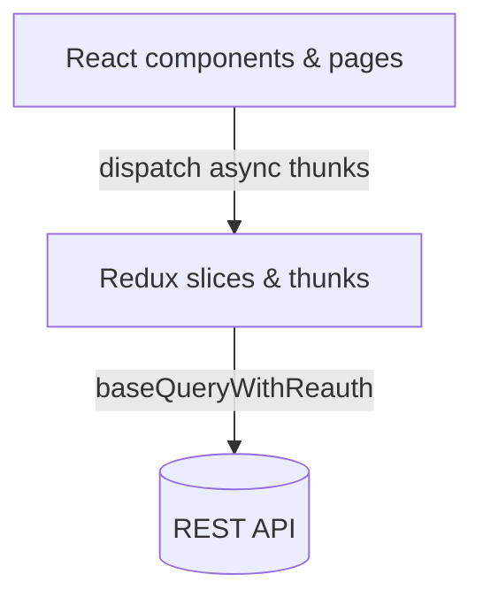

# Architecture

## Routing

- **Public**: `/`, `/login`, `/signup`, e‑commerce routes (`/shop`, `/product/:id`, etc.)
- **Protected**: `/dashboard` requires a valid `token` cookie.
- **Role gated**: within `/dashboard`, routes like `/users`, `/stores` and `/settings` require `role` of `system_admin`.

## State management

Redux Toolkit slices manage UI state:

| Slice | Responsibility |
|-------|----------------|
| `auth` | authentication tokens and user info |
| `user` | user list & pagination |
| `store` | store records & pagination |
| `cart` | e‑commerce cart state |

Asynchronous operations use `createAsyncThunk` backed by a shared `fetchBaseQuery` that handles token attachment and refresh. There is no RTK Query cache; components dispatch follow‑up queries after mutations.

## Error handling

API errors and success states surface as toast notifications. There is no global error boundary or automatic retry/backoff.
